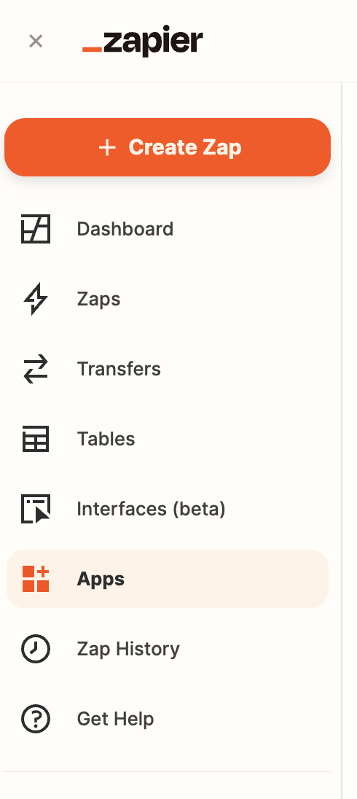

# Zapier's Overledger App

This user guide is to help people use the Overledger app available in the Zapier app store in 3 simple steps:

Step 1: Linking Your Overledger Account to Zapier
Step 2: Understanding How to Test Zapier's Overledger App
Step 3: Using Overledger on Zapier

Zapier is an industry-leading no-code development platform, where users create 'Zaps' to seamlessly integrate disparate systems and automate workflows.

Overledger is Quant’s powerful blockchain integration and tokenisation platform. By using new Overledger powered zaps, users can create automated sequences of API calls for actions such as data feeds, real time monitoring, and more – all without any knowledge of blockchain technology or writing a line of code. Like all zaps, Overledger powered zaps can include additional integrations to any other app in the Zapier app store (including A.I. tools, Business analytic tools, traditional database and office programs, etc), meaning that the automation possibilities are almost endless.

The actions available in Zapier's Overledger app currently reflect Overledger's V3 APIs. Other Overledger APIs can be used via Zapier's Webhooks app. 

*NOTE: Due to Zapier's internal company policy on payment processing products, the actions to 'execute a transaction' are unavailable publicly in Zapier's Overledger app at this time. Should Zapier's internal policy change, then the 'execute a transaction' actions will be made public. In the meantime, contact Quant at https://quant.network/contact/ if you want to build apps using this Overledger functionality*.

Finally, if you have any questions regarding the following steps, please contact Quant's technical support at support@quant.zendesk.com.


## Step 1: Linking Your Overledger Account to Zapier

Before using the Overledger app, you will need to register for a Quant Connect Account and then connect Zapier to your Quant Connect Account.

### Registering at Quant Connect

Quant Connect found [here](https://connect.quant.network/login) is the developer portal that allows users to create authentication keys in order to use the Overledger app. 

<p align="center" width="100%">
    
</p>

Your first step will be to click on the 'setup an account' link, directing you [here](https://connect.quant.network/register). Then you will need to follow the steps displayed on screen. 

### Creating an Application

Once registered, you will need to create an application in order to access the authentication keys to use in Zapier. To create an application, browse to the [My Applications section](https://connect.quant.network/my-applications/) seen below:

<p align="center" width="100%">
    
</p>

Now click on the orange cross button on the top right of the screen in order to add a new application. After which you will be presented with the following screen:

<p align="center" width="100%">
    
</p>

Enter your application name and be sure to enable your application for testnet signing by ticking the 'Enable testnet signing' box. Next select the networks that this application will be associated with, e.g.:

*Note that for free trial accounts, you will currently be allowed to access 2 test blockchain networks*.

<p align="center" width="100%">
    
</p>

You will then be presented with your application details that have been generated and added to your Quant Connect account, like so:

<p align="center" width="100%">
    
</p>

The `clientId`, `clientSecret`, `transaction signing key id` and `transaction signing name` are all important information that you will use in Zapier at different points. More specifically `clientId` and `clientSecret` are your Overledger Platform authentication keys, whereas `transaction signing key id` is your blockchain account for all of your selected blockchain networks and `transaction signing name` is required for the 'Sign Transaction' and 'Prepare, Sign and Execute a Smart Contract Transaction' actions in the Overledger Platform app.

*Note 1: The `clientSecret` is of course meant to be secret information. If it has been exposed, consider this application compromised and therefore do not continue to use it.*

*Note 2: You can access your application details at any time by clicking on the eye icon under actions on the My Applications screen:*

<p align="center" width="100%">
    
</p>

*Note 3: You will need to fund the key generated in your application with some testnet currency before you can sign transactions in through Overledger. To do so, copy the `transaction signing key id` and head over to any faucet compatible with your chosen network to receive tokens. Faucets are discussed in Step 2 below.*

### Adding Authentication Details into Zapier

Now that you have a `clientId` and a `clientSecret` from Quant Connect, we can add them into Zapier in order to establish an authenticated connection to the Overledger Platform.

To do so, browse to the 'your apps' section of your Zapier account [here](https://zapier.com/app/connections).

<p align="center" width="100%">
    
</p>

Then click on the '+ Add Connection' button:

<p align="center" width="100%">
    
</p>

Search for Overledger in the pop up box:

<p align="center" width="100%">
    
</p>

Now in the new screen, add the `clientId` and `clientSecret` parameters from the application you just created in Quant Connect:

<p align="center" width="100%">
    
</p>

Once complete, when you return to the 'your apps' section of your Zapier account, you will see that the 'Overledger Platform' has been added and the `clientId` you entered is available, like so:

<p align="center" width="100%">
    
</p>

Now you are ready to start creating Overledger powered Zaps!


## Step 2: Understanding How to Test Zapier's Overledger App

Before we go into the specifics of the Overledger Platform Zapier App, we provide the following information for all of the available blockchain networks, so that you can perform accurate testing:

- **Block Explorer**: How to browse the transactions for this blockchain network via a user interface.
- **Faucet**: How to get free testnet tokens for a test network. You need to receive test tokens in order to perform transactions on a test network. Note these are not available for main networks, because you will need to buy tokens from an exchange in order to transact. 
- **Example Smart Contracts**: Where to find example smart contracts deployed on a test network that can be used for easy Zapier action and trigger testing. This is not available for main networks as you can deploy your own smart contracts after testing them on one of our available test networks.

### Ethereum Sepolia Testnet

#### Block Explorers

- [Etherscan](https://sepolia.etherscan.io/).

#### Faucets

- [Chainstack Faucet](https://faucet.chainstack.com/sepolia-testnet-faucet) (only provides tokens to an account holding real ETH)
- [Alchemy Faucet](https://sepoliafaucet.com/)  (only provides tokens to an account holding real ETH)
- [Infura Faucet](https://www.infura.io/faucet/sepolia)
- [QuickNode Faucet](https://faucet.quicknode.com/ethereum/sepolia) (only provides tokens to an account holding real ETH)

#### Example Contracts

- Contract for General Function Testing: [0x3a637d769ed8530b483eeae70923d73dbad916c6](https://sepolia.etherscan.io/address/0x3a637d769ed8530b483eeae70923d73dbad916c6#code).
- Contract for Basic Parameter Type Testing: [0x0b13ce1dc7e2f04494e0d0a6b48d63641397e8eb](https://sepolia.etherscan.io/address/0x0b13ce1dc7e2f04494e0d0a6b48d63641397e8eb#code)
- Contract for Basic Parameter Type Event Testing: [0xeae97f80c62a8cf1ab4953e1ea85fb0c34d302c5](https://sepolia.etherscan.io/address/0xeae97f80c62a8cf1ab4953e1ea85fb0c34d302c5#code).

### Ethereum Goerli Testnet

#### Block Explorers

- [Etherscan](https://goerli.etherscan.io/).
  
#### Faucets

- [Chainstack Faucet](https://faucet.chainstack.com/goerli-testnet-faucet) 
- [Alchemy Faucet](https://goerlifaucet.com/) (only provides tokens to an account holding real ETH)
- [QuickNode Faucet](https://faucet.quicknode.com/ethereum/goerli/) (only provides tokens to an account holding real ETH)

#### Example Contracts

- Contract for General Function Testing: [0x3a637d769ed8530b483eeae70923d73dbad916c6](https://goerli.etherscan.io/address/0x3a637d769ed8530b483eeae70923d73dbad916c6#code).
- Contract for Basic Parameter Type Testing: [0x09ee73d29af30aaf6399b1c37c59e58e6406cdd6](https://goerli.etherscan.io/address/0x09ee73d29af30aaf6399b1c37c59e58e6406cdd6#code).
- Contract for Basic Parameter Type Event Testing: [0x0234c2a616e7a26cfd92b92b66324ad168794396](https://goerli.etherscan.io/address/0x0234c2a616e7a26cfd92b92b66324ad168794396#code).

### Polygon Mumbai Testnet

#### Block Explorers

- [Polygonscan](https://mumbai.polygonscan.com/).

#### Faucets

- [Polygon Faucet](https://faucet.polygon.technology/)
- [Alchemy Faucet](https://mumbaifaucet.com/)

#### Example Contracts

- Contract for General Function Testing: [0x59b01303288151bcaa11764309860e6dd99fce58](https://mumbai.polygonscan.com/address/0x59b01303288151bcaa11764309860e6dd99fce58#code).
- Contract for Basic Parameter Type Testing: [0xf246E076F6E3a172f66c02d3b300fc4F3B14b6e5](https://mumbai.polygonscan.com/address/0xf246E076F6E3a172f66c02d3b300fc4F3B14b6e5#code).
- Contract for Basic Parameter Type Event Testing: [0x8590d37d55049de2555f0f9541325e7fe6b19b17](https://mumbai.polygonscan.com/address/0x8590d37d55049de2555f0f9541325e7fe6b19b17#code).

### Avalanche Fuji Testnet

#### Block Explorers

- [Snowtrace.dev](https://snowtrace.dev/).
- [Snowtrace.io](https://testnet.snowtrace.io/).

#### Faucets

- [Avalanche Faucet](https://core.app/tools/testnet-faucet)

### Example Contracts

- Contract for General Function Testing: [0x31840eb575e09b8724e7da13184b420692435415](https://testnet.snowtrace.io/address/0x31840eb575e09b8724e7da13184b420692435415#code).
- Contract for Basic Parameter Type Testing: [0x0234c2a616e7a26cfd92b92b66324ad168794396](https://testnet.snowtrace.io/address/0x0234c2a616e7a26cfd92b92b66324ad168794396#code).
- Contract for Basic Parameter Type Event Testing: [0x59b01303288151bcaa11764309860e6dd99fce58](https://testnet.snowtrace.io/address/0x59b01303288151bcaa11764309860e6dd99fce58#code).

### Xdc Apothem Testnet

#### Block Explorers

- [Blocksscan](https://apothem.blocksscan.io/).
  
#### Faucets

- [XDC Network Faucet](https://faucet.apothem.network/)

#### Example Contracts

- Contract for General Function Testing: [xdc9fa4c0d6c830c6807ad18258d3ea20a363811991](https://apothem.xinfinscan.com/address/xdc9fa4c0d6c830c6807ad18258d3ea20a363811991#readContract)
- Contract for Basic Parameter Type Testing: [xdc6f91da0d3819710e49544c595d5b0544e5338837](https://apothem.blocksscan.io/address/xdc6f91da0d3819710e49544c595d5b0544e5338837#readContract).
- Contract for Basic Parameter Type Event Testing: [xdc014113d78cde64dcf73d2717b5b2249279f1b4d5](https://apothem.blocksscan.io/address/xdc014113d78cde64dcf73d2717b5b2249279f1b4d5#readContract).

### Ethereum Mainnet

#### Block Explorers

- [Etherscan](https://etherscan.io/).

### Polygon Mainnet

#### Block Explorers

- [Polygonscan](https://polygonscan.com/).

### Avalanche C-Chain Mainnet

#### Block Explorers

- [Snowtrace.dev](https://snowtrace.dev/).
- [Snowtrace.io](https://snowtrace.io/).

### XDC Network Mainnet

#### Block Explorers

- [Blocksscan](https://explorer.xinfin.network/).

## Step 3: Using Overledger on Zapier

A quick-start guide to using Zapier can be found [here](https://zapier.com/resources/guides/quick-start). 

The Overledger App on Zapier has available triggers and actions.

All of the triggers and actions fall into two main categories:

1. Reading Data: Overledger allows data to be read from the blockchain. Currently, in the Zapier Overledger app, users can read data from specific smart contract functions.
2. Monitoring Data: Overledger allows for the possibility to monitor either (a) smart contracts for event firings; or (b) blockchain accounts for when a transaction is sent to or from a particular address. In the Zapier Overledger app, users can create, read, update, and delete webhooks monitoring both smart contracts and blockchain accounts.

All of these categories of functionality share consistent input fields as well as having some additional bespoke fields, both of which will be discussed over the next few subsections. 

### Available Overledger Instance, Technology and Network Combinations

Each Zapier Overledger trigger and action requires you to define the Overledger Instance, the Blockchain Technology, and the Blockchain Network to interact with.

The currently available options on Zapier are listed in the following table:

| Overledger Instance | Technology | Network |
| ----------- | ----------- | ----------- |
| Sandbox | ethereum | ethereum sepolia testnet |
| Sandbox | ethereum | ethereum goerli testnet |
| Sandbox | ethereum | polygon mumbai testnet |
| Sandbox | ethereum | avalanche fuji testnet |
| Sandbox | ethereum | xdc apothem testnet |
| Production | ethereum | ethereum mainnet |
| Production | ethereum | polygon mainnet |
| Production | ethereum | avalanche c-chain mainnet |
| Production | ethereum | 	xdc network mainnet |

As you can see, the `Sandbox` Overledger instance allows you to connect to test blockchain `networks` (which hold no real-world value tokens), whereas the Production Overledger instance allows you to connect to the main blockchain networks (which hold tokens with a real value).

Also note that currently, Zapier only supports the Ethereum blockchain `technology`. In the future additional technologies can be added to the Zapier integration if required. Contact [Quant](https://quant.network/) if you have any questions regarding this.


### Reading Data from a Blockchain

Reading data from a blockchain can be completed in one Zapier action in the Overledger app, called `Read a Smart Contract Function`.

Once you have selected this action and your Overledger Platform account (which you setup in Step 1 above), you should fill in the action input fields, which we break down into the following points below:

1. Select the Overledger Instance, Technology and Network

The possible options are listed above.

*In the following examples, we will be using the `Sandbox` Overledger Instance with the `ethereum` Technology and the `polygon Mumbai testnet` network.*

2. Select the Smart Contract Identifier

Overledger requires you to define the specific identifier of the smart contract you want to read from. For Ethereum technologies, this identifier is equal to the contract's address.

For testing, you can use the example smart contract identifiers found [here](##smart-contract-addresses).

*In the following examples, we will be using the 'Basic Parameter Type Testing Contract' deployed on the polygon mumbai network at this address [0xf246E076F6E3a172f66c02d3b300fc4F3B14b6e5](https://mumbai.polygonscan.com/address/0xf246E076F6E3a172f66c02d3b300fc4F3B14b6e5#code). Therefore the smart contract identifier of this smart contract is `0xf246E076F6E3a172f66c02d3b300fc4F3B14b6e5`.*

3. Select the Function Name

Overledger requires you to define the specific name of the smart contract function you want to read. 

You will have to look at the smart contract code to understand the functions available for this contract. Potentially you will have the code available to you locally. Or you will need to go to a block explorer and search for that particular contract identifier and look at the code in the block explorer - if it is available. Smart contract code might not have been uploaded to a block explorer as this is a manual and optional process conducted by the creator of the smart contract.

*For example, we can see in the polygonscan block explorer [here](https://mumbai.polygonscan.com/address/0xf246E076F6E3a172f66c02d3b300fc4F3B14b6e5#readContract), that possible read function names include: (a) `number`; (b) `readOneAInputOneAOutput`; (c) `readOneUIInputsTwoUIOutputOneTwoEight`; (d) `readTwoSInputsOneSOutput`; and (e) `readTwoUIInputsTwoUIOutputs`.*

4. Understand the Function's Input and Output Parameters

Overledger requires you to define the input and output parameters of the smart contract function you want to read from. 

Each input parameter needs a `type` and `value` parameter. Whereas each output parameter requires a `type` parameter. 
 
For each Ethereum technology based network, Overledger supports the core Solidity Types described [here](https://docs.soliditylang.org/en/latest/types.html). They are as follows: 
- Basic Types: `uint`, `int`, `string`, `address`, `bool`, `bytes`, any of the following `{uint8,uint16,...,uint248,uint256}` and any of the following `{bytes1,bytes2,...bytes31,bytes32}`
- Dynamic Array Types: `uint[]`,`int[]`,`string[]`,`address[]`,`bool[]`, `bytes[]`, any of the following `{uint8[],uint16[],...,uint248[],uint256[]}` and any of the following `{bytes1[],bytes2[],...bytes31[],bytes32[]}`
- Fixed Array Types: `uint[X]`,`int[X]`,`string[X]`,`address[X]`,`bool[X]`,`bytes[X]`, any of the following `{uint8[X],uint16[X],...,uint248[X],uint256[X]}` and any of the following `{bytes1[X],bytes2[X],...bytes31[X],bytes32[X]}`, where `X` is an unsigned integer.
  
*For example, we can see in the polygonscan block explorer [here](https://mumbai.polygonscan.com/address/0xf246E076F6E3a172f66c02d3b300fc4F3B14b6e5#readContract), that possible read function options include: (a) the `number` function - requiring no inputs and one `uint256` type output; (b) the `readOneAInputOneAOutput` function - requiring one `address` type input and one `address` type output; (c) the `readOneUIInputsTwoUIOutputOneTwoEight` function - requiring one `uint128` type input and two `uint128` type outputs; (d) the `readTwoSInputsOneSOutput` function - requiring two `string` type inputs and one `string` type output; and (e) the `readTwoUIInputsTwoUIOutputs` function - requiring two `uint` type inputs and two `uint` type outputs.*

5. Example Request and Responses

This Zapier Overledger action relates to the Overledger Platform API found [here](https://docs.overledger.io/V3.0.0/tag/Create-A-Smart-Contract-Read-Transaction).

Note that the contract used for testing is a simple one where all the read functions have very basic functionality - to return the same value as given in the input.

*For our Zapier examples we present the following screenshots*:

(a) number - requiring no inputs and one `uint256` type output. Input Fields example:

<p align="center" width="100%">
    
</p>

(a) number - requiring no inputs and one `uint256` type output. Response body example:

<p align="center" width="100%">
    
</p>

(b) readOneAInputOneAOutput - requiring one `address` type input and one `address` type output. Input Fields example:

<p align="center" width="100%">
    
</p>

(b) readOneAInputOneAOutput - requiring one `address` type input and one `address` type output. Response body example:

<p align="center" width="100%">
    
</p>

(c) readOneUIInputsTwoUIOutputOneTwoEight - requiring one `uint128` type input and two `uint128` type outputs. Input Fields example:

<p align="center" width="100%">
    
</p>

(c) readOneUIInputsTwoUIOutputOneTwoEight - requiring one `uint128` type input and two `uint128` type outputs. Response body example:

<p align="center" width="100%">
    
</p>

(d) readTwoSInputsOneSOutput - requiring two `string` type inputs and one `string` type output. Input Fields example:

<p align="center" width="100%">
    
</p>

(d) readTwoSInputsOneSOutput - requiring two `string` type inputs and one `string` type output. Response body example:

<p align="center" width="100%">
    
</p>

(e) readTwoUIInputsTwoUIOutputs - requiring two `uint` type inputs and two `uint` type outputs. Input Fields example:

<p align="center" width="100%">
    
</p>

(e) readTwoUIInputsTwoUIOutputs - requiring two `uint` type inputs and two `uint` type outputs. Response body example:

<p align="center" width="100%">
    
</p>


### Monitoring Data on a Blockchain

Registering to monitor a smart contract or blockchain account can be completed in one Zapier action, called `Create a Webhook` in the Overledger app.

Once you have selected this action and your Overledger account (which you setup in Step 1 above), you should fill in the action input fields, which we break down into the following points below:

1. Select the Overledger Instance, Technology and Network

The possible options are listed above.

2. Select the Webhook Type and Address

Overledger requires you to define the specific webhook type and the address. Overledger supports two types of webhooks:

- Account: Monitoring transactions sent to or from a particular address.
- Smart Contract: Monitoring events fired (emitted) from a smart contract.

You should select the webhook type you prefer and then input the address, which will be equal to the smart contract identifier, should you want to monitor a particular smart contract.

For testing, you can use the example smart contract identifiers found [here](##smart-contract-addresses).

*In the following examples, for the smart contract monitoring testing we will be using the 'Basic Parameter Type Event Testing Contract' deployed on the polygon mumbai network at this address [0x8590d37d55049de2555f0f9541325e7fe6b19b17](https://mumbai.polygonscan.com/address/0x8590d37d55049de2555f0f9541325e7fe6b19b17#code). Therefore the smart contract identifier of this smart contract is `0x8590d37d55049de2555f0f9541325e7fe6b19b17`. Whereas for the account testing, we will be using the non-smart contract account at this address[0x1789d90438333751fdcca0d03d8952168b99ef02](https://mumbai.polygonscan.com/address/0x1789d90438333751fdcca0d03d8952168b99ef02), Therefore the identifier of this account is `0x1789d90438333751fdcca0d03d8952168b99ef02`*
  
3. Example Request and Responses

This Zapier Overledger action relates to the two different Overledger APIs found [here](https://docs.overledger.io/V3.0.0/tag/Create-Webhook-for-Smart-Contract-Events) (for the smart contract webhook type) and [here](https://docs.overledger.io/V3.0.0/tag/Create-Webhook-for-Account-Updates) for the account webhook type.

*For our Zapier examples we present the following screenshots*:

(i) Create a smart contract webhook. Input Fields:

<p align="center" width="100%">
    
</p>

(i) Create a smart contract webhook. Response body:

<p align="center" width="100%">
    
</p>

(ii) Create an account webhook. Input Fields:

<p align="center" width="100%">
    
</p>

(ii) Create an account webhook. Response body:

<p align="center" width="100%">
    
</p>


4. Await callback data

Once the monitoring has been setup, Overledger will serve data as and when it occurs. To trigger this process a transaction will have to be sent to the monitored address (for the account webhook type to fire), and additionally this transaction will have to trigger a smart contract event (for the smart contract webhook type to fire).

*For our Zapier examples we present the following example data*:

(i) Create a smart contract webhook. callback data:

The following is example callback data received for an example webhookId when a smart contract emits an event.
```
{
  "type": "smartContractEvent",
  "webhookId": "6c964253-4b10-43a5-a812-9b30e92275a3",
  "location": {
    "technology": "ethereum",
    "network": "polygon mumbai testnet"
  },
  "smartContractEventUpdateDetails": {
    "smartContractId": "0x8590d37d55049de2555f0f9541325e7fe6b19b17",
    "nativeData": {
      "removed": false,
      "logIndex": 0,
      "transactionIndex": 0,
      "transactionHash": "0xde2bbf9704d726ff395eb78217e9acb226b0ecb0b609021cccd7e67d99763db2",
      "blockHash": "0x6d1a13d15fd0a90f361d3e368830bbe45c628382c4533d10f1a23ae699c781cc",
      "blockNumber": "0x28b2471",
      "address": "0x8590d37d55049de2555f0f9541325e7fe6b19b17",
      "data": "0x0000000000000000000000001789d90438333751fdcca0d03d8952168b99ef02",
      "topics": [
        "0x2d1801d4e6df986759c8582affebc974bcf0cacfd5d2ab120eb776efa53dffa2"
      ]
    }
  }
}
```
To parse this callback data correctly, you will need to have access to the smart contract code to understand it. Please refer [here](https://codeburst.io/deep-dive-into-ethereum-logs-a8d2047c7371) to understand how to decode smart contract events.

(ii) Create an account webhook. Callback data:

Account callback data is simpler than smart contract callback data, making it easier to understand. Below is example callback data received for an example webhookId when a transaction is sent to or from the monitored address.

```
{
  "type": "account",
  "webhookId": "20f6ce08-04b4-4ce4-94eb-e2304a0737af",
  "accountId": "0x282f70d5af34aedaac479b12a08e189bbee83066",
  "location": {
    "technology": "ethereum",
    "network": "polygon mumbai testnet"
  },
  "transactionId": "0xd65c16e476a5ad5fa89ffe14512bd7984e575a4370ac86ccfb88202da20f9262"
}
```

5. Manage your webhook

Now that your webhook is up and running, through one Zapier action in the Overledger app, you can do the following:

- Read it via the `Read a Webhook` action; 
- Update it (by providing a new callback URL) via the `Update a Webhook` action; or
- Delete it via the `Delete a Webhook` action.

Additionally, you can read all the webhooks associated with this clientId via the `Read Webhooks` action. 
